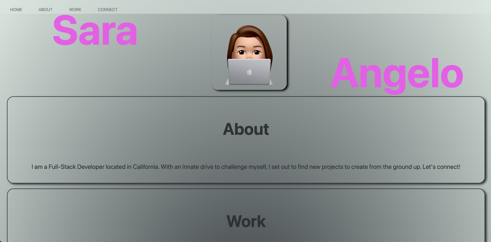

# professional-portfolio

## Description

This professional portfolio of Sara Angelo (the developer) is a webpage rendered by utilizing HyperText Markup Language and Cascading Style Sheets. In this webpage, the user can view information about the developer, their work, and how to contact them. When one of the navigation links are clicked, the UI scrolls to the corresponding section. When the work section is clicked, the UI scrolls to a section with titled images of the developer's applications. When the user is presented with the developer's first application, that image is larger in size. When the user clicks on the image of the application, the user is taken to the respective application. Specific use of media queries and styling in CSS enables a responsive layout when the page is resized.

## Screenshot

## Link to webpage:

https://saramangelo.github.io/professional-portfolio/

## License

MIT License

Copyright (c) 2022 saramangelo

Permission is hereby granted, free of charge, to any person obtaining a copy
of this software and associated documentation files (the "Software"), to deal
in the Software without restriction, including without limitation the rights
to use, copy, modify, merge, publish, distribute, sublicense, and/or sell
copies of the Software, and to permit persons to whom the Software is
furnished to do so, subject to the following conditions:

The above copyright notice and this permission notice shall be included in all
copies or substantial portions of the Software.

THE SOFTWARE IS PROVIDED "AS IS", WITHOUT WARRANTY OF ANY KIND, EXPRESS OR
IMPLIED, INCLUDING BUT NOT LIMITED TO THE WARRANTIES OF MERCHANTABILITY,
FITNESS FOR A PARTICULAR PURPOSE AND NONINFRINGEMENT. IN NO EVENT SHALL THE
AUTHORS OR COPYRIGHT HOLDERS BE LIABLE FOR ANY CLAIM, DAMAGES OR OTHER
LIABILITY, WHETHER IN AN ACTION OF CONTRACT, TORT OR OTHERWISE, ARISING FROM,
OUT OF OR IN CONNECTION WITH THE SOFTWARE OR THE USE OR OTHER DEALINGS IN THE
SOFTWARE.
